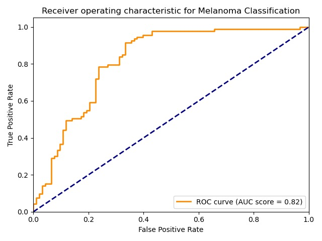
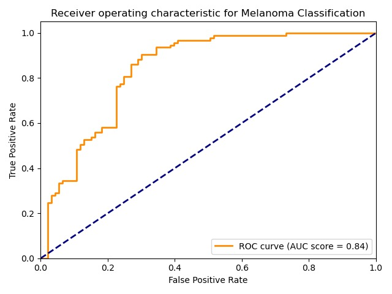

# Melanoma-classification

This work is done in 2020 spring CS324 Deep learning group project @ SUSTech

In the project, I Implemented a GooLeNet to complete a binary classification to judge if a given Melanoma by a picture is benign or malignant. The best accuracy is around 81%- 82% within 200 epochs

### The ROC curve of GooLeNet

After I shared my trained model with groupmates and use bagging to combine all the members’ model together, the overall accuracy is improved by round 0.6 percent after adding my model.

